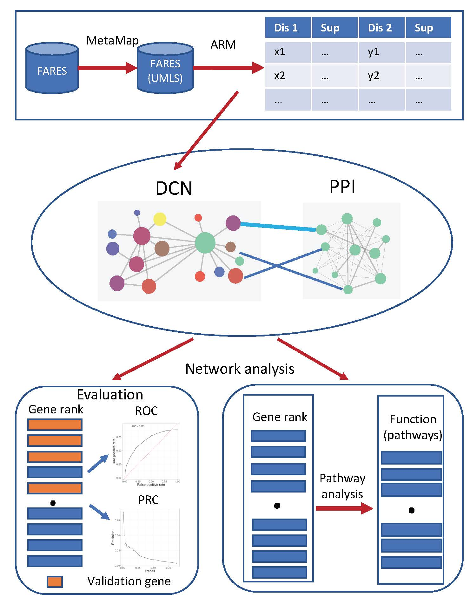

# AD-Genetics-Prediction
A large-scale phenotype-based AD disease gene prediction

## Introduction
Alzheimer’s disease (AD) is a severe neurodegenerative disorder and has become a global public health problem. Intensive research has been conducted for AD. But the pathophysiology of AD is still not elucidated. Disease comorbidity often associates diseases with overlapping patterns of genetic markers. This may inform a common etiology and suggest essential protein targets. US Food and Drug Administration (FDA) Adverse Event Reporting System (FAERS) collects large-scale post-marketing surveillance data that provide a unique opportunity to investigate disease co-occurrence pattern. We aim to construct a heterogeneous network that integrates disease comorbidity network from FAERS with protein-protein interaction to prioritize the AD risk genes using network-based ranking algorithm.

## Methods

  

## Documentation for modules
1. __*assoc_rules:*__ Provides classes for generate and processing association rules from FAERS using FP-Growth algorithm
1. __*network:*__ Provides classes for DCN and DCN0PPI construction
1. __*graph_algorithm:*__ Provides classes for graph algorithms used in this project, including random walk with restart (rwr),random graph generation and *do novo* predition of AD risk genes
1. __*util:*__ Provides utility classes used in this project

## Results
This folder contains four files listed below.

1. __*fares_comm_net_lift_final_abbr:*__ DCN network file that contains 1,538 disease nodes and 21,312 edges, which was extracted from FAERS using Association Rule Mining
  
  &nbsp;&nbsp;&nbsp;&nbsp;Format: 
  &nbsp;&nbsp;&nbsp;&nbsp;dis1_UMLS|dis1_name|dis1_SOC|dis1_SOC_idx|dis2_UMLS|dis2_name|dis2_SOC|dis2_SOC_idx|conf

  &nbsp;&nbsp;&nbsp;&nbsp;* *dis1_UMLS:* UMLS code for disorder 1
  &nbsp;&nbsp;&nbsp;&nbsp;* *dis1_name:* Name for disorder 1
  &nbsp;&nbsp;&nbsp;&nbsp;* *dis1_SOC:* System Organ Class (MedDRA) for disorder 1
  &nbsp;&nbsp;&nbsp;&nbsp;* *dis1_SOC_idx:* SOC index for disorder 1

  &nbsp;&nbsp;&nbsp;&nbsp;* *dis2_UMLS:* UMLS code for disorder 2
  &nbsp;&nbsp;&nbsp;&nbsp;* *dis2_name:* Name for disorder 2
  &nbsp;&nbsp;&nbsp;&nbsp;* *dis2_SOC:* System Organ Class (MedDRA) for disorder 2
  &nbsp;&nbsp;&nbsp;&nbsp;* *dis2_SOC_idx:* SOC index for disorder 2

  &nbsp;&nbsp;&nbsp;&nbsp;* *conf:* Confidence for disease pair relationship. Since this is an undirected and unweighted graph, value is set to 1.0.

1.  __*DCN_PPI_net.txt:*__ The heterogeneous network file that contains 19,398 nodes (1,538 disease nodes and 17,860 gene nodes) and 1,401,358 edges.
Format: UMLS_ID or gene symbol|UMLS_ID or gene symbol|weight
Note: The edge weigh is set to 1.0 since the network is undirected and unweighted.

1.  __*disUMLS_name.txt:*__ A disease node mapping file from UMLS ID name to disease concept name
Format: UMLS_ID|disease_name

1.  __*AD_novel_genes.csv:*__ A file that contains novel AD risk genes we predicted from DCN_PPI network
Format: Rank,Gene

